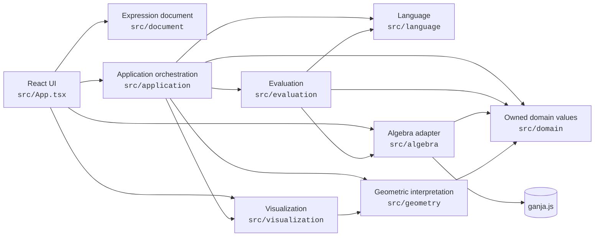
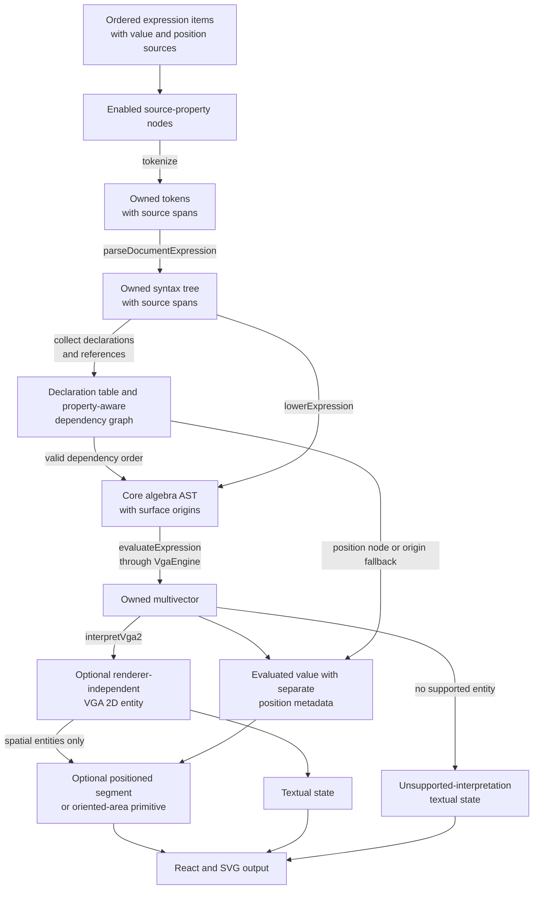

# Application Architecture

**Status:** Current direction
**Date:** 2026-07-30
**Scope:** Initial VGA(2) vertical slice

## Purpose

This document explains how the application code is separated today, which
layer owns each responsibility, and which dependencies may cross those
boundaries. It records implementation direction rather than a normative public
contract. Requirements and specifications remain authoritative for observable
behavior.

The current architecture favors small, explicit transformations between owned
representations. This keeps source-language behavior, mathematical values,
geometric meaning, and rendering concerns independently testable. The
boundaries should remain stable as capabilities grow, but directory names and
individual interfaces may change when implementation evidence supports a
better design.

## Current dependency direction

Arrows in this diagram mean “imports or calls.” Dependencies point inward
toward language, domain, and algebra concerns; the lower layers do not import
application or presentation code.

The application layer coordinates the complete use case, so it is expected to
depend on several focused layers. `App.tsx` also acts as the current composition
root by constructing the algebra adapter and passing it into the application
use case. Those focused layers must not depend back on the application layer or
React.

## Evaluation and rendering flow

The current application parses every non-empty item, builds document-level name
and dependency information, then evaluates valid branches in dependency order:

Parsing and dependency failures stop only the affected graph branch and return
owned, source-associated diagnostics. Missing names, duplicate declarations,
cycles, and invalid upstream dependencies are distinct states. Independent
branches continue evaluating, and editing or deleting a declaration recomputes
its transitive dependants from current source; stale values are not retained. A
successful evaluation never exposes the ganja.js object used inside the algebra
adapter. The standard VGA(2) interpretation classifies every exact owned value
as a scalar, vector, bivector, rotor, or mixed multivector. A valid scalar has a
textual state but no spatial render primitive. Vectors produce oriented
segments. Bivectors produce signed-area loops, or construction-aware
parallelograms for safe direct outer products. Rotors and mixed multivectors
remain valid and inspectable while their visualization state is unsupported.

Standard geometric interpretation depends only on the owned multivector value.
Equivalent expressions therefore receive the same semantic entity:
`vector(0, 0)`, `(0, 0)`, and scalar `0` all evaluate to the all-zero multivector and are
classified canonically as scalar zero.

Expression item identities are independent of their source and list position.
Adding, editing, or deleting one item preserves sibling identities. Items are
parsed independently, then named declarations and anonymous expressions are
evaluated against one document-level declaration table. References may point
forward or backward in row order. Declaration names are unique and
case-sensitive; built-in VGA names remain reserved. Supported primitives are
composed in document order, regardless of evaluation order. Each item may own a
separate position source. Position nodes are active for single vectors and
single bivectors; lists inherit element positions, while scalars, rotors, mixed
multivectors, and lists preserve any stored position source without evaluating
it. Bare references target value nodes, `V.position` and
`B.position` target position nodes, and vector-only `V.head` derives the sum of
the vector value and position. Missing or invalid position results use the
origin without changing or invalidating a valid positioned value. Vectors and
bivectors produce spatial primitives from their separately owned positions.
Direct named-vector outer products may retain enough surface construction
provenance to select a parallelogram without changing value-based interpretation.

The in-memory document owns renderer-independent item appearance records keyed
by stable item identity. Visibility, label visibility, label text, and semantic
style identifiers never enter owned multivectors. One appearance record applies
to every rendered element of a list. Natural normalization is a separate
algebraic item flag applied before dependent expressions resolve; it is not
appearance metadata. Its canonical document representation is the nullable
`Item.normalization` field, whose initial non-null value is `natural`. Theme
selection changes CSS display tokens only. It is session state in the current
slice; the persistence boundary will later read and write the canonical
`ViewState.display.theme` field without affecting evaluation.

The interface layer owns the presentation defaults applied when a stored
appearance property is absent, including the mapping from semantic object kind
to style identifier and the fallback from empty label text to the declared name.
One resolver serves both the expression row and the visualizer so an item cannot
be described one way and drawn another. The kind-to-style mapping is an ordered
table rather than a branch, so the algebra reference documents it from the same
source the renderer resolves through. Transient appearance surfaces render to
the document body with viewport-aware placement and return focus to the control
that opened them.

Reference content is authored as data and rendered through one shared definition
table, so a presentation change never edits documentation text. The algebra
reference composes those algebra facts with the interface-owned default palette
at render time; color remains absent from algebra data.

The initial semantic style registry contains six shades for each red, blue,
green, yellow, and neutral ramp. Documents store only registered identifiers;
the renderer owns their concrete colors. Canonical validation rejects unknown
identifiers, while the interface resolver uses `blue-4` only as a defensive
fallback for unvalidated in-memory state. Non-spatial values use the resolved
color in the expression panel without gaining visibility or label controls.

Document update operations also include an atomic clear transition that removes
all expression items and their item-keyed appearance records while retaining the
document object and its identity. Because history is not implemented in the
current slice, the interface exposes that transition only after a one-second
sustained pointer or keyboard activation, closes transient appearance UI, and
returns focus to the add-expression control.

The common evaluator owns a multivector-or-flat-list value union above the
algebra engine. List literals and ranges create stable element records;
distributive unary and binary operations preserve order and derive deterministic
result identities while sending only individual multivectors through the VGA
engine. Indexing returns one multivector with its selected element identity kept
on the evaluated record. Position metadata follows element identity and
operation lineage outside mathematical values. Compatible positions propagate,
one positioned operand supplies the result position, and conflicting positions
produce a geometry diagnostic without invalidating the list value. Presentation
renders the supported prefix and reports elements omitted by rendering limits.

The surface AST preserves constructor and operator syntax for diagnostics and
future language-aware editing. Lowering removes syntax sugar before evaluation;
in VGA(2), `vector(x, y)` and `(x, y)` become `x * e1 + y * e2`. Constructor notation and
blade notation consequently share the same core evaluator and algebra-engine
operations. Compact blades also lower through generator products: `e12` becomes
`e1 * e2`, while `e21` becomes `e2 * e1`, allowing the algebra product to derive
`e21 = -e12`. Outer, convention-defined inner, and regressive products,
reverse, dual, grade involution, grade projection, coefficient extraction, and
the pseudoscalar lower to dedicated core operations. Their implementation remains behind the owned-value
engine boundary; convention fixtures use project-owned analytical results
rather than treating ganja.js as the expected-result authority.

Function calls remain generic in the surface tree so source spans and future
definition registration do not require one parser node per function. Lowering
maps supported calls to explicit core operations. Expected algebra failures
cross the engine boundary as owned operation errors; evaluation attaches the
originating source span before application presentation. Owned multivectors
reject non-finite coefficients at construction, so `NaN` and infinities cannot
enter interpretation or rendering state.

## Directory responsibilities

| Location | Owns | Does not own |
| --- | --- | --- |
| `src/document` | Stable expression item identities, separately owned value and position sources, canonical JSON validation and migration, ordered item updates, the document item-count boundary, and browser persistence behind a storage interface | Parsing, evaluation, dependencies, or React focus |
| `src/language` | Tokenization, declaration and expression syntax, reference nodes, lowering to the core algebra AST, source spans, and syntax diagnostics | Document-wide name resolution, algebra computation, geometric meaning, rendering, or React state |
| `src/evaluation` | Evaluation of owned core syntax against explicit algebra capabilities and resolved reference values | Parsing, dependency planning, backend construction, display formatting, or viewport behavior |
| `src/algebra` | The algebra-engine interface and ganja.js adaptation | Public source semantics, UI state, geometric interpretation, or rendering |
| `src/domain` | Backend-independent mathematical values and shared diagnostics | Backend objects, SVG primitives, browser APIs, or React types |
| `src/geometry` | Conversion from owned algebra values to renderer-independent semantic entities | Parsing, backend operations, screen coordinates, or SVG |
| `src/visualization` | Renderer-neutral positioned primitives and explicit mathematical-to-screen transforms | Algebra identifiers, backend values, source parsing, or application state |
| `src/application` | Document-wide declaration resolution, dependency ordering, use-case orchestration, and conversion of failures into application states | React rendering, DOM events, backend-specific operations, or CSS |
| `src/App.tsx`, `src/components`, and styles | User input, accessible presentation, reference dialogs, and SVG composition from application state | Language rules, algebra semantics, or backend value inspection |
| `src/types` | Narrow declarations for untyped external packages | Domain models or feature behavior |

Tests are colocated with the layer whose behavior they establish. Integration
tests at the UI boundary verify that the composed workflow exposes values,
diagnostics, recovery, and textual visualization state.

## Code documentation convention

Exported APIs use TSDoc-compatible `/** ... */` comments when their contracts
include information that TypeScript cannot express directly. In particular,
document:

- ownership and copying rules at layer or backend boundaries;
- mathematical conventions, coefficient ordering, and coordinate orientation;
- source-span, unit, range, and normalization conventions;
- meaningful preconditions, invariants, failure modes, and `null` results;
- architectural intent whose loss could introduce a reverse dependency.

Do not add comments that merely restate a symbol name, enumerate fields already
clear from a type, narrate an implementation, or speculate about an unapproved
future design. Private helpers need comments only when they contain a
non-obvious invariant or algorithmic choice.

Architecture documents remain responsible for relationships between modules,
while code comments describe individual API contracts. Normative language and
mathematical behavior remain in their owning requirements and specifications.
Generated API documentation is intentionally deferred; TSDoc compatibility
allows a future TypeDoc-based system without making generated pages or comment
coverage a current delivery requirement.

## Boundary rules

1. Ganja.js values, typed arrays, generated functions, exceptions, and graphing
   APIs stay inside `src/algebra`. The adapter copies results into owned domain
   values before returning.
2. Source text is parsed and evaluated by MultiVector code. It is never passed
   to a backend evaluator or ganja.js `inline`.
3. Domain values contain mathematical data, not presentation state or backend
   behavior.
4. Algebra-specific standard interpretation is a deterministic function of the
   owned value. Source spelling and construction history do not change the
   resulting semantic entity.
5. Visualization primitives contain neither algebra identifiers nor
   multivector coefficients. They describe renderable geometry and accessible
   meaning.
6. Viewport transformations affect screen coordinates only. They never change
   evaluated values or semantic entity coordinates.
7. React owns interaction and presentation composition. Business rules remain
   callable and testable without React or a browser DOM.
8. Diagnostics retain source spans across the parsing and application
   boundaries and are presented textually rather than inferred again in the
   UI.
9. Dependency order is derived from references, not row position. Invalid graph
   branches have no value, while independent branches continue evaluating.
10. Position is evaluated and propagated as record metadata. It never enters
    owned multivector coefficients or changes standard geometric interpretation.

These rules implement the replacement boundaries described in
[Technology Decisions](technology-decisions.md) and the ownership constraints
in the [Design Requirements](../design-requirements.md).

## Extension points

The current vertical slice retains several extension points:

- document state owns stable identities, value and position sources, algebra
  configuration, appearance, view configuration, and the current persisted
  revision;
- dependency analysis expands from the current declaration table and acyclic
  traversal into bounded reusable planning nodes for every persisted source
  property;
- commands own validated document changes and history boundaries rather than
  allowing UI components to mutate domain state directly;
- persistence owns canonical JSON, migration, local storage, and failed-write
  recovery behind an application-facing interface; its browser adapter can
  move from one-key Web Storage to IndexedDB without changing document rules;
- interaction translates pointer or keyboard intent into semantic edit
  requests; geometry and document rules decide whether source can be rewritten;
- render adapters consume shared visualization primitives, allowing SVG to be
  replaced or supplemented without changing algebra or geometry layers.

Document objects may later retain construction provenance to derive labels or
default appearance. That metadata remains separate from the owned multivector
and may affect presentation only; it does not change algebraic equality or the
standard geometric interpretation.

New cross-cutting behavior should be placed in the narrowest layer that can own
it without creating a reverse dependency. If a feature requires algebra
identifiers in shared visualization code, backend values in application state,
or source parsing in React components, the boundary should be reconsidered
before implementation proceeds.

## Review triggers

Review this document when a change introduces a new production layer, moves a
responsibility across an existing boundary, adds another algebra or renderer,
or reveals that the dependency direction prevents a required workflow. Update
the diagrams and responsibility table with the implementation so they describe
the repository rather than an aspirational structure.
