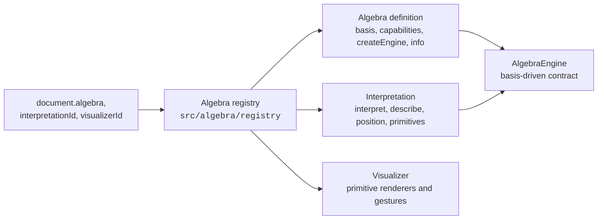

# Multi-Algebra Registration Delta

**Status:** Proposed for review
**Issue:** #98
**Date:** 2026-09-13
**Decision owner:** Algebra-definition and interpretation architecture

## 1. Purpose

The [PGA 2D Foundation milestone](../requirements/milestones/pga-2d-foundation.md)
makes the registered-algebra boundary a completion criterion (P2D-001): the
second algebra must be selected by `document.algebra` and the interpretation
and visualizer identifiers, with no production component importing a VGA or
PGA module directly or branching on an algebra identifier. This document lists
what in the 0.1.0 code base prevents that today and the ordered, individually
mergeable steps that remove it **before** the first PGA line is written.

Every step is a behavior-preserving refactor of the VGA(2) path: the 0.1.0
fixtures (378 tests) stay green unchanged, apart from mechanical renames, and
the deployed VGA workflow is re-smoke-tested after each merge that touches the
viewport.

## 2. Where VGA(2) is hard-coded today

| Layer | Coupling | Evidence |
| --- | --- | --- |
| Domain | Owned values carry no basis: `OwnedMultivector` is a bare coefficient array and `inspectMultivector` names blades from the constant `VGA_2D_BLADE_NAMES` | `src/domain/multivector.ts` |
| Algebra | The engine contract is nominal and VGA-shaped: `VgaEngine` with `basisBlade('e1' \| 'e2')`, `grade(0 \| 1 \| 2)`, `coefficient('e' \| 'e1' \| 'e2' \| 'e12')`; no registry, `App.tsx` calls `createVga2Engine()` directly; algebra information is a VGA constant | `src/algebra/vgaEngine.ts`, `src/algebra/vga2Info.ts`, `src/App.tsx` |
| Language | Blade tokens are the literal set `e1, e2, e12, e21`; `e12` is lowered to the product `e1 * e2`; blade property access is the same literal set; `vector` is a keyword-level constructor; `ps` is documented as `e12` | `src/language/tokenize.ts`, `ast.ts`, `lowerExpression.ts`, `parseExpression.ts`, `expressionReference.ts` |
| Evaluation | `evaluateExpression` is typed against `VgaEngine` and dispatches constructors and blades on VGA-specific node kinds | `src/evaluation/evaluateExpression.ts` |
| Application | `evaluateDocument`, `evaluateSource`, and `evaluateScalarControl` import `VgaEngine` and `vga2Interpretation` directly; position eligibility (`isPositionMultivector`) encodes VGA-POS rules in the application layer | `src/application/*.ts` |
| Geometry | Entities, descriptions, position support, and primitive mapping are VGA(2) functions rather than an interpretation contract | `src/geometry/vga2Interpretation.ts`, `src/visualization/primitives.ts` |
| Visualization and UI | `App.tsx` (2 600 lines) renders oriented segments and areas inline and owns head/base manipulation, anchoring, and direct literal rewriting through `directVectorEdit`; `visualizerActive` and the canonical validator compare against the literal `org.multivector.vga-2d` | `src/App.tsx`, `src/language/directVectorEdit.ts`, `src/document/canonicalDocument.ts` |
| Document | New documents default to VGA(2) by constant; there is no way to create or switch to another algebra; the algebra information dialog is VGA-specific | `src/document/expressionDocument.ts`, `src/components/AlgebraInfoDialog.tsx` |

## 3. Target shape

- An **algebra definition** publishes identity, parameter schema, the
  `AlgebraBasis` (ordered blade names, grades, display aliases, named
  constants), the capability set, `createEngine(parameters)`, and the
  information shown in the algebra dialog.
- An **`AlgebraEngine`** is one contract for every definition: values carry
  their basis, blade and coefficient access take basis blade names validated
  against the basis, optional operations are capabilities (ALG-028) that
  produce the common capability diagnostic when absent.
- An **interpretation** is resolved by identifier and version and owns entity
  classification, descriptions, position eligibility, and the mapping from
  entities to renderer-independent primitives.
- A **visualizer** renders primitives by kind and owns the gestures that make
  sense for each kind; the application shell composes them.
- The **registry** resolves the three identifiers from a document into that
  triple, or returns the ALG-005 diagnostic while preserving source.

## 4. Ordered steps

Each step is one engineering issue and one pull request, mergeable alone; the
parent issue #145 tracks their order.

### Step 1 — Basis-driven owned values and engine contract (#137)

Introduce `AlgebraBasis` and attach it to owned values; replace the nominal
`VgaEngine` by `AlgebraEngine` whose `basisBlade`, `grade`, `coefficient`, and
`pseudoscalar` are driven by the basis; make `inspectMultivector` basis-driven.
The VGA(2) adapter implements the contract; grade and blade fixtures move to
basis-driven assertions.

### Step 2 — Algebra registry and composition root (#138)

Add `src/algebra/registry.ts` with `registerDefinition` and
`resolveAlgebra(document.algebra)`; register VGA; make `App.tsx`,
`expressionDocument.ts` defaults, and `canonicalDocument.ts` validation obtain
identifiers and engines through the registry; an unknown definition or
version yields the ALG-005 diagnostic and keeps the source. Algebra
information comes from the definition.

### Step 3 — Basis-aware language and capability-gated functions (#139)

Tokenize any `e` followed by digits as a blade token and validate it against
the active basis at evaluation (permuted names carry the permutation sign, as
both conventions require); lower blades without VGA-specific products; turn
`vector` into a registered constructor capability and add the function-call
dispatch that `point`, `ipoint`, `line`, `norm`, and `inorm` will use; take
`ps` from the engine. VGA syntax and diagnostics are unchanged for VGA
documents; a constructor absent from the active algebra yields the common
capability diagnostic.

### Step 4 — Interpretation boundary (#140)

Define the `Interpretation` contract (`interpret`, `describe`,
`supportsPosition`, `toPrimitives`, entity identifiers) in `src/geometry`;
make the VGA(2) interpretation implement it; route `evaluateDocument`,
`evaluateSource`, `evaluateScalarControl`, and `primitives.ts` through the
contract; move VGA-POS position eligibility behind the VGA interpretation. Add
the primitive kinds PGA will need — point marker, unbounded line, direction
marker — as types only.

### Step 5 — Viewport rendering and gestures by primitive (#141)

Extract the SVG rendering of oriented segments and areas, and the head, base,
anchoring, and cancellation gestures, from `App.tsx` into `src/visualization`
modules keyed by primitive kind, with the application shell composing them.
Generalize `directVectorEdit` into constructor-literal rewriting parameterized
by constructor name and arity so that `vector(x, y)` and, later, `point(x, y)`
share one path. `App.tsx` no longer knows which primitive kinds exist.

### Step 6 — Algebra selection in the document workflow (#142)

Allow a new or empty document to select a registered algebra and
interpretation (command, history, persistence, canonical validation through
the registry); make the algebra dialog render the definition's information;
keep 0.1.0 documents loading unchanged.

### Step 7 — PGA(2) definition and engine (#143)

Register `org.multivector.pga` with the basis, capabilities, and ganja.js
`Cl(2,0,1)` adapter; replay `pga2ReferenceFixtures.ts` through the engine;
add PGA-004 parameterization cases. No interpretation or visualizer yet:
values evaluate and inspect textually.

### Step 8 — PGA(2) interpretation and visualizer (#144)

Implement `org.multivector.pga-2d` (PGA-INT) and the PGA primitive renderers
and literal point dragging (PGA-VIZ); documented example; acceptance record
for the milestone.

## 5. Invariants during the delta

- No step changes a VGA convention, document format, or 0.1.0 canonical
  document; renames of internal types are the only permitted test edits.
- Backend values never cross the engine boundary (ALG-010); adding a basis to
  owned values does not expose ganja.js storage.
- Every capability diagnostic uses the common categories (ALG-030); the
  language never branches on `algebraId` (ALG-029).
- `App.tsx` shrinks at every step that touches it; a step that grows it is
  reviewed against P2D-001.

## 6. Out of scope

VGA(3), PGA(3), CGA, motor logarithms, figure export, and any change to the
0.1.0 supported-browser statement.
