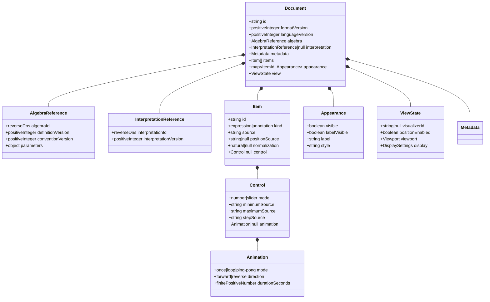
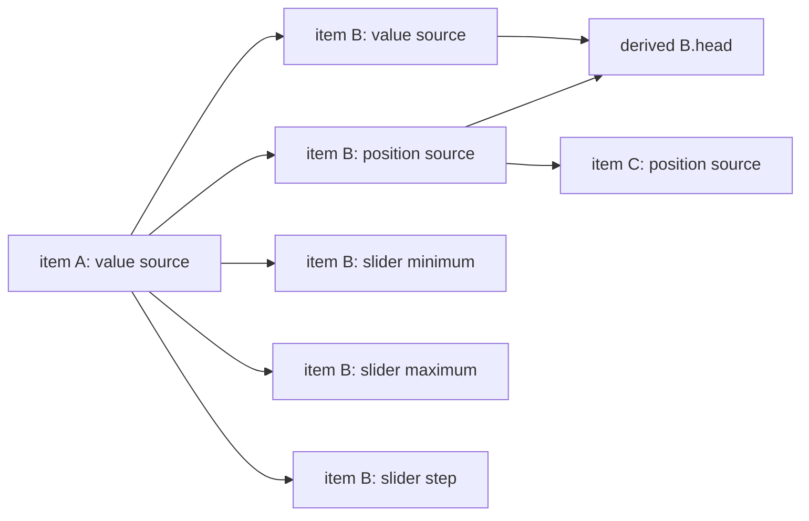

# MultiVector Document Format

**Status:** Draft for review
**Date:** 2026-07-30
**Format version:** 1
**Refines:** DOC-001 through DOC-012
**License:** MIT

## 1. Purpose and authority

This document specifies the serialized document structure, canonical JSON rules,
validation boundary, and dependency-node model for format version 1. All local,
imported, exported, shared, and example documents use this structure.

Stored source is authoritative. Tokens, abstract syntax trees, evaluated values,
render primitives, active playback, transient selection, focus, dialog state,
and undo or redo stacks are derived or session state and are never serialized.

### Current implementation subset

The in-memory expression document currently owns stable item identities, value
source, and an optional separate position source. Value and position sources
are evaluated as distinct dependency nodes for interpreted single vectors and
single bivectors; lists inherit element positions, and other value kinds
preserve position source without activating it.

The current in-memory subset also owns sparse item-keyed appearance records:
visibility, label visibility, label text, and style may each be absent, and one
resolver supplies the deterministic defaults. These sparse records are
application state, not canonical JSON; a canonical `Appearance` contains every
required field described in section 2.2. A common list record applies to every
rendered element. Natural normalization
is modeled by the canonical nullable `normalization` field on an expression
item. It changes the value seen by dependent expressions without rewriting
source and remains separate from appearance and numeric controls. The current
theme selector updates display tokens immediately and populates and restores
canonical `ViewState.display.theme`.

The current document operations include an atomic clear transition. It replaces
`items` with an empty array and `appearance` with an empty object while retaining
all document-level identity and configuration fields. The sustained-hold
confirmation and subsequent focus restoration are interface behavior and are
not serialized.

Canonical JSON serialization, strict version-one validation, local persistence,
and explicit JSON import and export are implemented. Imports whose identity
collides with the open document offer replacement or duplication; duplication
regenerates the document and every item identity while preserving ordered
canonical content. Appearance, natural
normalization, source, position source, document identity, metadata, and theme
round-trip through that boundary. Numeric-control records are validated and
preserved through the nullable `control` field, but their interactive runtime
behavior is not implemented yet. Annotation source is preserved as
non-executable content and never enters parsing or evaluation. Both closed
viewport variants restore deterministically: `none` disables the visualizer,
while the supported two-dimensional record restores center and zoom. An
unsupported visualizer/viewport combination remains in the document and
produces an explicit recovery diagnostic. Viewport display controls and
annotations do not yet have dedicated editing interfaces. This note records
implementation evidence and does not change the normative serialized structure
below.

## 2. Structure

GitHub renders the following Mermaid diagram. The field tables below, rather
than the diagram layout, are normative.

Every object listed below is closed: an unknown field is invalid in format
version 1. A required nullable field shall be present even when its value is
`null`.

Later format versions may introduce explicitly named extension containers under
DOC-011. Format version 1 defines none. Implementations shall never treat an
unknown field as an implicit extension.

### 2.1 Document

| Field | Type | Rule |
| --- | --- | --- |
| `id` | string | Non-empty opaque immutable document identity. |
| `formatVersion` | positive integer | Exactly `1` after migration. |
| `languageVersion` | positive integer | Selects source syntax and semantics. |
| `algebra` | `AlgebraReference` | Selects one validated algebra configuration. |
| `interpretation` | `InterpretationReference \| null` | At most one active interpretation. |
| `metadata` | `Metadata` | Descriptive, non-executable document metadata. |
| `items` | `Item[]` | Ordered; item identities shall be unique. |
| `appearance` | object | Keys are item identities and values are `Appearance`; no orphan key is valid. |
| `view` | `ViewState` | Persistent presentation state. |

`Metadata` has exactly `title` and `description`, both strings. These fields
have no language or markup semantics.

`AlgebraReference` has exactly `algebraId`, `definitionVersion`,
`conventionVersion`, and `parameters`. Identifiers and versions follow DOC-010.
`parameters` is a closed definition-owned JSON object validated and
canonicalized before the document enters application state.

`InterpretationReference` has exactly `interpretationId` and
`interpretationVersion`. Its identifier is a lowercase reverse-DNS identifier
and its version is a positive integer.

### 2.2 Items, appearance, and controls

An `Item` has exactly `id`, `kind`, `source`, `positionSource`, `normalization`,
and `control`. Its identity is a non-empty opaque immutable string. `kind` is
`expression` or `annotation`; `source` is stored verbatim. An annotation
requires `positionSource`, `normalization`, and `control` to be `null`.

`positionSource` is either `null` or source text stored verbatim. It is preserved
when position support is disabled. When enabled, it participates in the
dependency graph described below.

`normalization` is `null` or `natural`. `natural` requests the active algebra's
versioned natural-normalization service after evaluating the item's source and
before dependent expressions resolve it. When normalization is unavailable, the
service returns the unchanged value according to the algebra convention. The
field does not rewrite source and is independent of appearance and `control`.

`control` is `null` or an object with exactly `mode`, `minimumSource`,
`maximumSource`, `stepSource`, and `animation`. `mode` is `number` or `slider`.
The three sources are stored verbatim and use the common language.
`animation` is `null` or an object with exactly `mode`, `direction`, and
`durationSeconds`, using the values shown in the diagram. Active playback and
its source snapshot are not stored. Animation may be configured in either
control mode; both modes use the same minimum, maximum, step, and animation
fields, and changing `mode` preserves them.

An `Appearance` has exactly `visible`, `labelVisible`, `label`, and `style`. The
first two fields are booleans. `label` is stored plain text; an empty value uses
the deterministic semantic default. `style` is a registered non-empty,
palette-independent style identifier. Appearance is item-level in format
version 1; list elements do not have independent stored appearance.

#### 2.2.1 Initial style registry

The initial registry contains six ordered shades in each semantic ramp:
`red-1` through `red-6`, `blue-1` through `blue-6`, `green-1` through
`green-6`, `yellow-1` through `yellow-6`, and `neutral-1` through `neutral-6`.
These identifiers are canonical document data. Their concrete color values are
renderer-owned and are not serialized.

When an item has no stored style, the current VGA interface applies these
deterministic defaults:

| Semantic kind | Style identifier |
| --- | --- |
| Scalar | `green-4` |
| Vector | `yellow-4` |
| Bivector | `red-4` |
| Rotor | `blue-3` |
| Mixed multivector | `blue-4` |
| List | `green-3` |
| Unregistered semantic kind | `blue-4` |

Canonical validation rejects an unregistered style identifier. A renderer may
use `blue-4` as a defensive display fallback for invalid or pre-validation
in-memory data, but that fallback never makes the record canonically valid.
For a scalar or another non-spatial value, style affects its expression-panel
presentation only; visibility and visualizer-label controls are unavailable.

### 2.3 View state

`ViewState` has exactly `visualizerId`, `positionEnabled`, `viewport`, and
`display`. `visualizerId` is a stable visualizer identifier or `null`.
`positionEnabled` is a boolean and can be true only when the selected
interpretation and visualizer advertise position support.

Format version 1 supports these closed `viewport` variants:

- `{ "kind": "none" }` when no visualizer is active;
- `{ "kind": "two-dimensional", "centerX": number, "centerY": number,
  "zoom": number }`, where all numbers are finite and `zoom` is positive.

`DisplaySettings` has exactly `decimalPlaces`, `axisLabelsVisible`,
`graduationsVisible`, `gridVisible`, `objectScale`, and `theme`.
`decimalPlaces` is an integer from 0 through 15, `objectScale` is finite and
positive, the visibility fields are booleans, and `theme` is `light`, `dark`, or
`system`. Later format versions may add viewport variants through migration.

## 3. Canonical JSON

A canonical document is encoded as UTF-8 JSON without a byte-order mark,
insignificant whitespace, or a trailing newline. Object keys are ordered by
Unicode code point. Array order is preserved. Strings use JSON escaping and are
not Unicode-normalized.

Numbers use the shortest decimal representation that round-trips to the same
finite IEEE 754 binary64 value. Negative zero is emitted as `0`. `NaN`,
infinities, duplicate JSON keys, lone surrogate code points, and integers outside
the safe integer range are invalid. Version fields and bounded integer settings
shall additionally satisfy their field rules.

Canonicalization is idempotent: canonicalizing canonical bytes returns the same
bytes. Import followed by export without a document mutation shall therefore be
byte-stable.

## 4. Validation and migration

Shared fragments and raw JSON imports have distinct bounded preprocessing
pipelines.

A shared fragment is processed in this order:

1. enforce the encoded shared-fragment size limit before decoding;
2. decode the bounded share envelope and validate its version and declared
   compression/encoding identifier;
3. verify the envelope integrity check before decompressing or interpreting its
   payload as a document;
4. decompress, when applicable, while enforcing both the expansion-ratio and
   decoded-document-size limits;
5. obtain the complete JSON bytes.

A raw JSON import is processed in this order:

1. enforce the decoded-document-size limit directly on the input bytes;
2. decode those bytes as strict UTF-8.

Both paths then enter the same document-processing pipeline:

1. parse JSON while rejecting duplicate keys and invalid scalar values;
2. read only `formatVersion` to select a trusted migration;
3. migrate one version at a time without evaluating source;
4. validate the complete current schema and resource limits;
5. resolve the algebra and optional interpretation;
6. build dependency nodes, parse source, and evaluate.

The encoded shared-fragment limit does not apply to raw JSON imports. Neither
preprocessing path may pass partial, integrity-failing, malformed, or
over-limit JSON to the common pipeline.

All bounds used by these steps are owned by the
[limits and interaction constants](limits-and-constants.md).

Unavailable algebra or interpretation implementations do not make the stored
structure invalid. They enter the recovery behavior defined by DOC-012 and
DIM-005. A migration shall be deterministic, preserve source and identities
unless its documented format change makes that impossible, and never silently
discard a field.

## 5. Dependency nodes

Mathematical and appearance sources share one directed graph without merging
their values:

Each enabled source property is a separate graph node identified by item
identity and property: `value`, `position`, `control.minimum`,
`control.maximum`, or `control.step`. A name reference to `V` targets the value
node of the uniquely named item `V`; `V.position` targets its position node; and
`V.head` is a read-only derived node depending on both.

Cycles are detected over all enabled nodes. Every node in a cycle receives the
common cycle diagnostic, and its dependants receive upstream diagnostics.
Self-reference through `V.position` or `V.head` is therefore a cycle. A disabled
position source is preserved but has no active node, dependencies, evaluation,
or diagnostics.

Evaluation produces records that associate an owned mathematical value with
item or list-element identity and optional position. Position is metadata on
that record, never a coefficient or field of a multivector. List operations
preserve element order, derived identity, and position record-by-record. Binary
list operations require corresponding positioned elements to have equal
positions; one positioned and one unpositioned operand retains the positioned
operand; conflicting positions produce a position diagnostic without changing
the mathematical result. These rules do not alter algebra-engine operations.
